# Pelalawan CSR Portal — Product Requirements Document

**Version:** 1.0  
**Date:** 18 August 2026  
**Status:** Authoritative product scope for the frontend-first rewrite  
**Product owner:** Fachry, CEO Aryendbumi  
**Primary operator:** Bappeda Kabupaten Pelalawan  
**Initial language:** Bahasa Indonesia

> This document supersedes previous product scope, workflow, dashboard, mockup,
> and delivery-sequence documents. Earlier documents remain historical context.
> Repository security, portability, and implementation constraints continue to
> apply unless this PRD explicitly changes the product scope.

## 1. Product summary

Portal CSR Pelalawan is a controlled public transparency portal and operational
workspace for CSR reporting in Kabupaten Pelalawan.

The product has one central loop:

```text
Company submits CSR activity
        ↓
Bappeda reviews and requests revision when needed
        ↓
Company resubmits corrections
        ↓
Bappeda approves and publishes
        ↓
Public sees the published result
```

The public portal communicates what has been officially published. The company
workspace helps a company complete its reporting. The Bappeda workspace helps
operators make decisions and follow up exceptions. The superadmin console
controls access, company assignments, and audit history.

## 2. Product vision

Make CSR reporting in Pelalawan easier to submit, easier to verify, and easier
for the public to understand.

### Product principles

1. **Action before analytics.** Authenticated dashboards answer “what do I need
   to do next?” before showing secondary statistics.
2. **Publication is a deliberate act.** Submitted or approved content is not
   public until Bappeda publishes it.
3. **Missing is not zero.** Unknown, not reported, reported zero, reported
   amount, and not expected to report remain distinct.
4. **One workflow, clear ownership.** Every action has an obvious actor and
   next step.
5. **Dynamic data.** Company lists, sectors, categories, and counts are derived
   from records. No fixed company count is a product rule.
6. **Private by default.** Contacts, notes, drafts, private evidence, raw
   imports, and storage details stay inside authorized workspaces.
7. **Frontend first.** The product is validated through realistic fixtures and
   complete browser journeys before new database or storage design begins.
8. **Human-owned publishing.** AI may prepare a draft, but Bappeda remains
   responsible for editing and publishing it.

## 3. Goals and non-goals

### Goals for V1

- Provide a trustworthy public CSR dashboard and company directory.
- Let provisioned company admins submit CSR activities with private evidence.
- Let Bappeda review, request revision, approve, and publish activities.
- Let company admins manage standalone documents that may support multiple
  activities.
- Let company admins propose changes to their company profile.
- Let Bappeda publish news, CSR announcements, and MoU announcements.
- Let Bappeda manage operational follow-up queues.
- Let superadmins create users, assign companies, manage company master data,
  and inspect audit history.
- Provide basic account management for company and Bappeda users.

### Explicitly out of scope

- Public self-registration.
- Shared company accounts.
- Company authority to approve or publish its own content.
- Opportunity, tender, or procurement boards.
- Automated WhatsApp or email notifications.
- Payments.
- Electronic signatures.
- External government integrations.
- Multi-regency administration.
- Generic recurring Excel import automation.

Historical Excel reconciliation remains a separate later delivery after the
core product experience is accepted.

## 4. Users and product surfaces

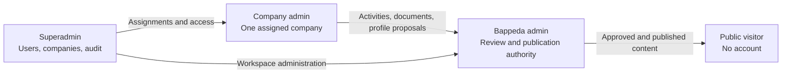

| Surface | Primary job | Landing-page question |
|---|---|---|
| Public portal | Explore published information | “What CSR work has been officially published?” |
| Company workspace | Complete reporting tasks | “What do I need to submit or fix?” |
| Bappeda workspace | Review and operate | “What needs my decision today?” |
| Superadmin console | Control access and master data | “Who can access what, and what changed?” |

## 5. Information architecture

### Public navigation

`Ringkasan · Perusahaan · Kegiatan CSR · Berita · MoU · Masuk`

Public screens:

- Public dashboard.
- Searchable company directory.
- Permanent public company profile.
- Published CSR activity directory and detail.
- Published company-document directory and detail when enabled.
- News listing and detail.
- Public MoU listing and detail when enabled.

### Company navigation

`Beranda · Kegiatan CSR · Dokumen · Profil perusahaan · Panduan · Akun saya`

Company screens:

- Company dashboard.
- Activity list, detail, create, edit, and revision flow.
- Standalone-document list, detail, create, edit, and submission flow.
- Current public profile and proposed profile changes.
- Reporting guidance.
- Account settings.

### Bappeda navigation

`Beranda · Review CSR · Dokumen · Perusahaan · Berita · MoU · Tindak lanjut · Akun saya`

Bappeda screens:

- Operations dashboard.
- CSR review queue and review detail.
- Document review queue and detail.
- Company master and profile-proposal review.
- News CMS and publication preview.
- MoU register and publication controls.
- Follow-up queues.
- Account settings.

### Superadmin navigation

`Pengguna · Perusahaan · Penugasan · Audit log · Pengaturan`

Superadmin screens:

- User creation and account status.
- Role and company assignment.
- Company master add/edit/archive/restore.
- Audit history.
- System configuration.

## 6. Shared visual and interaction direction

The public dashboard and company workspace references establish one visual
language with role-specific density.

### Shared visual language

| Role | Value |
|---|---|
| Cream background | `#EEECDF` |
| Deep green | `#132318` |
| Panel | `#F8F6EC` |
| Main ink | `#1C2620` |
| Soft ink | `#4B5A50` |
| Gold | `#AD7C2E` |
| Soft gold | `#D9B872` |
| Green | `#3E6B4F` |
| Border | `#D8D3BF` |

- Fraunces for editorial display headings.
- IBM Plex Sans for interface text.
- IBM Plex Mono for rupiah values, identifiers, and compact labels.
- Public pages are spacious and explanatory.
- Company pages are guided and task-oriented.
- Bappeda pages are denser and queue-oriented.
- Superadmin pages are compact and administrative.

### Shared component patterns

- Current-context header: user, company, workspace, or publication date.
- One dominant primary action per page.
- Status badge with a plain-language next action.
- Progress/completeness indicator where a task can be incomplete.
- Search and filters near the list they control.
- Detail drawer or sheet for quick inspection.
- Full permanent detail page for shareable public records.
- Confirmation before publication, archive, restore, or destructive removal.
- Visible keyboard focus, labeled fields, accessible dialogs, and responsive
  empty/error/loading states.

## 7. Canonical status and publication rules

### CSR activity states

The canonical activity workflow has exactly five states:

```text
draft → submitted → revision requested → submitted → approved → published
```

Ownership:

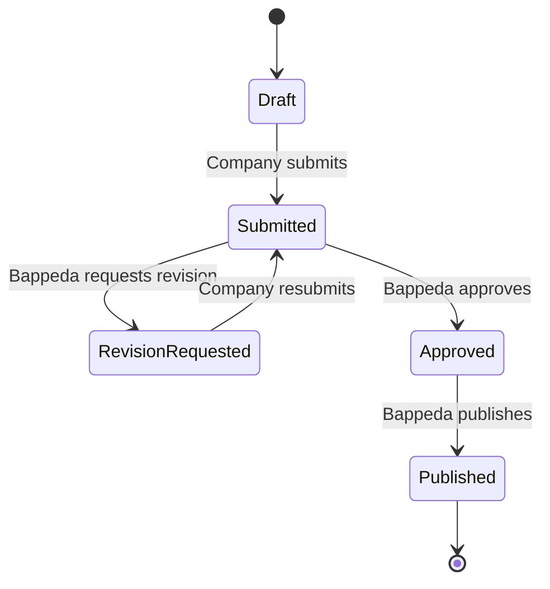

- `draft`: editable by the company admin.
- `submitted`: waiting for Bappeda review.
- `revision requested`: editable by the company admin with visible feedback.
- `approved`: accepted by Bappeda but not yet public.
- `published`: public read models may display the record.

There is no canonical `rejected` or `pending_review` status in the new frontend
product vocabulary.

### Other publication states

- News: `draft → ready to publish → published → archived`.
- Standalone company document: uses the five review states above.
- Company profile proposal: uses the five review states above.
- MoU: `draft → approved → published → archived`.

### Public visibility

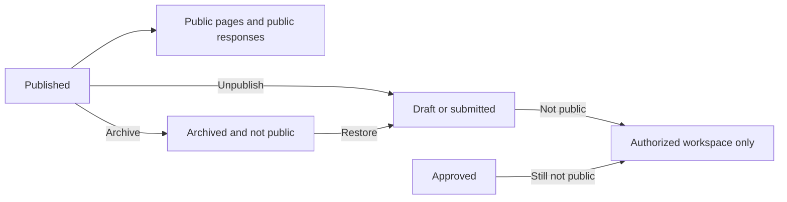

Only explicitly published records enter public pages or public responses.

## 8. Core workflows

### 8.1 Priority order

| Priority | Workflow | Product result |
|---|---|---|
| P0.1 | Company submits CSR activity → Bappeda review/revision → approval/publication | Published CSR activity appears publicly |
| P0.2 | Bappeda creates AI-assisted news or MoU announcement → edits → publishes | Public news/announcement page |
| P0.3 | Company uploads standalone document → Bappeda review/revision → publication | Public company document when approved |
| P0.4 | Company edits company profile → Bappeda review/revision → approval/publication | Updated public company profile |
| P0.5 | Public visitor opens portal → selects year → searches/filters → inspects detail | Clear published transparency experience |
| P0.6 | Superadmin creates user and assigns company | Company account can enter its workspace |
| P0.7 | Bappeda follows missing data and contacts | Operational exceptions become actionable |

### 8.2 CSR activity submission

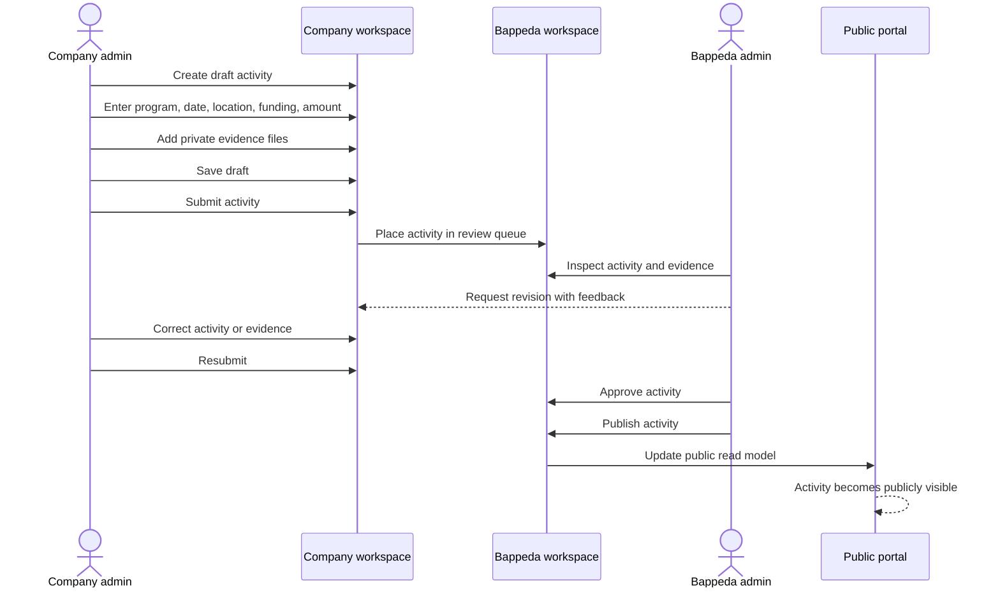

#### Activity input

Required or supported fields:

- Program/activity name.
- CSR category.
- Activity date.
- District and village/location.
- Funding type: cash, goods, service, or mixed.
- Whole-rupiah contribution amount.
- Private evidence files.
- One concise activity summary, if needed.

Explicitly removed:

- Beneficiary count.
- Beneficiary description.
- Duplicate outcome/additional-description fields.

Evidence may include photos, PDF, Excel, Word, and other approved document
types. Exact production limits and allowed MIME types are an implementation
and operations decision, not a reason to constrain the frontend prototype.

### 8.3 Standalone company-document submission

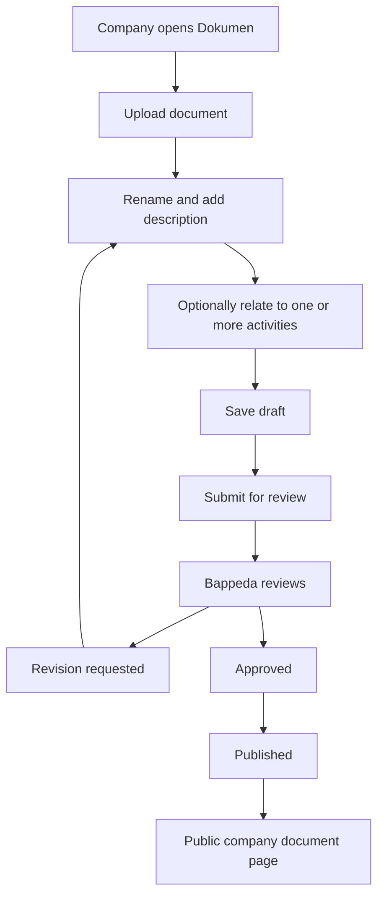

A standalone document is valid without a CSR-activity relationship. It may
cover several activities from the same reporting period.

Document categories:

| Type | Owner | Default visibility | Public when |
|---|---|---|---|
| CSR evidence | Company | Private | Used for authorized review; not normally public |
| Standalone company document | Company | Private | Bappeda approves and publishes |
| MoU document | Bappeda | Private | Bappeda marks it public and publishes the MoU |
| News image | Bappeda | Draft/private | Related news article is published |

### 8.4 Company profile proposal

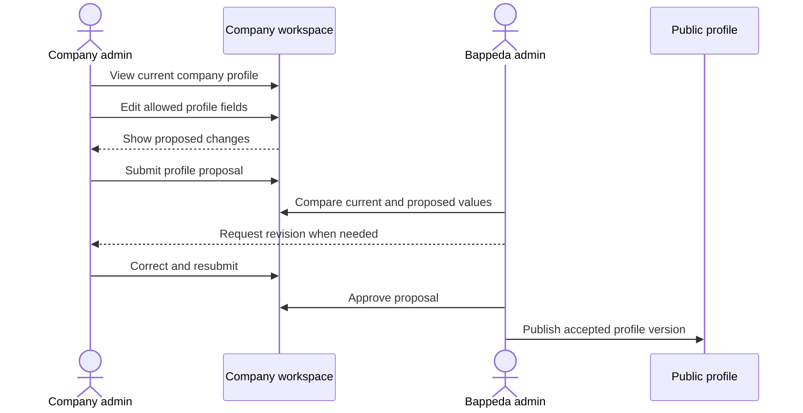

Pending company edits never silently replace the currently published profile.
The company can propose changes only for its assigned company. Archiving or
removing a company from active operations remains a Bappeda/superadmin action.

### 8.5 Bappeda news and AI-assisted publishing

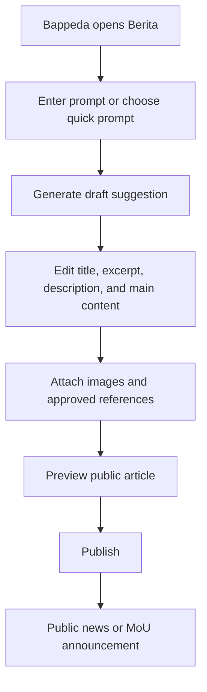

News fields:

- Clean title.
- Excerpt.
- Description.
- Main content.
- Cover image and supporting images.
- Optional related CSR activity, document, or MoU.
- Public share action.
- Likes and comments surface.

AI never publishes automatically. The frontend phase uses realistic generated
fixtures. OpenRouter integration is added only after the editor and publication
experience is accepted. Public comments and likes require a later moderation
and abuse-control decision before production rollout.

### 8.6 Public visitor exploration

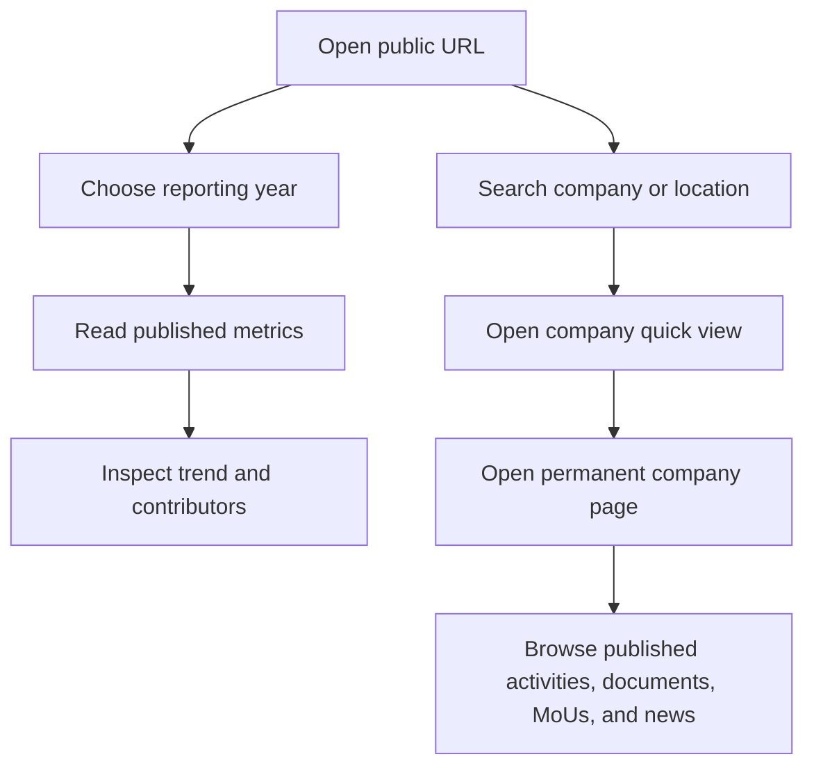

The public dashboard should explain the period, source/update context, and
meaning of missing values. It must not expose private contacts, internal notes,
raw imports, object keys, drafts, or private evidence.

### 8.7 Superadmin and account management

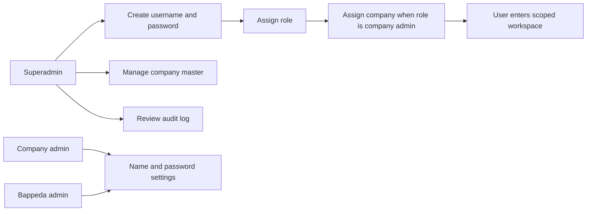

Standard account management includes editing display name and changing the
password. Public registration is disabled.

## 9. Dashboard requirements

### 9.1 Public dashboard

The public dashboard must provide:

- Selected reporting-year control.
- Published CSR total for that year.
- Reporting coverage for that year.
- Number of reporting companies.
- Trend chart with text/table alternative.
- Contributor ranking for the selected period.
- Searchable company directory.
- Sector and reporting-status filters when data supports them.
- Latest published activities, news, and MoU content.
- Clear data-source and last-updated context.

### 9.2 Company dashboard

The company dashboard must provide:

- Assigned company identity.
- A greeting and one current task message.
- Primary `Tambah aktivitas` action.
- Reporting completeness/progress.
- Current submissions and next actions.
- Counts for draft, submitted, revision requested, approved, and published.
- Revision feedback prominently displayed.
- Recent activities list with search.
- Document-management entry point.
- Profile-proposal entry point.

### 9.3 Bappeda dashboard

The Bappeda dashboard must prioritize queues:

- CSR activities waiting for review.
- Activities with revision requested.
- Approved activities waiting for publication.
- Documents waiting for review.
- Company profile proposals waiting for review.
- Companies with no report for the selected year.
- Companies with incomplete profile data.
- Companies with missing current contacts.
- News drafts waiting for publication.
- MoUs approaching expiry.

Metrics are secondary to the list of actions the operator can take.

### 9.4 Superadmin dashboard

The superadmin dashboard must provide:

- User count and account status.
- Company-assignment overview.
- Unassigned company admins.
- Recent audit events.
- Access to company archive/restore and user management.

## 10. Functional requirements

### Public portal

| ID | Requirement | Acceptance |
|---|---|---|
| PUB-01 | Select reporting year | All selected-year metrics and lists update together |
| PUB-02 | Show published CSR metrics | Only published records contribute |
| PUB-03 | Explain missing data | Empty values are not rendered as zero |
| PUB-04 | Search companies | Search works by company name and supported location text |
| PUB-05 | Filter directory | Sector and reporting-status filters work when applicable |
| PUB-06 | Open quick view | Company summary opens without losing directory context |
| PUB-07 | Open permanent profile | Public company page has a stable route |
| PUB-08 | Browse published activities | Draft/private activities never appear |
| PUB-09 | Browse public news and MoU | Only published content appears |
| PUB-10 | Protect private evidence | Public detail shows review indicator, not private files |

### Company workspace

| ID | Requirement | Acceptance |
|---|---|---|
| COM-01 | Sign in to assigned workspace | User sees only its assigned company context |
| COM-02 | See company dashboard | Dashboard shows current tasks and submissions |
| COM-03 | Create CSR draft | Draft can be saved before all fields are complete |
| COM-04 | Add supported evidence | UI supports the agreed file categories |
| COM-05 | Submit activity | Submission requires the required activity fields and evidence |
| COM-06 | View workflow status | Exact five-state vocabulary is used |
| COM-07 | Revise and resubmit | Revision feedback is visible and submission can return to review |
| COM-08 | Manage standalone documents | Upload, rename, describe, delete while editable, and submit |
| COM-09 | Propose profile changes | Proposed values are separate from current published values |
| COM-10 | Manage account | User can edit display name and change password |

### Bappeda workspace

| ID | Requirement | Acceptance |
|---|---|---|
| BAP-01 | View action queues | Queues show count, reason, owner, age, and next action |
| BAP-02 | Review CSR activity | Reviewer sees submitted fields, evidence, and history |
| BAP-03 | Request revision | Feedback is required and visible to the company |
| BAP-04 | Approve activity | Approved content remains private until publication |
| BAP-05 | Publish activity | Published activity appears in public fixtures/read models |
| BAP-06 | Review documents | Reviewer can approve or request revision |
| BAP-07 | Review profiles | Reviewer can compare current and proposed profile values |
| BAP-08 | Manage company master | Company records can be corrected, archived, and restored |
| BAP-09 | Publish news | Human-edited content can be previewed and published |
| BAP-10 | Manage MoU | Parties, dates, documents, status, and visibility are maintained |
| BAP-11 | Follow up missing data | Missing reports, contacts, and incomplete profiles are actionable |
| BAP-12 | Manage account | User can edit display name and change password |

### Superadmin

| ID | Requirement | Acceptance |
|---|---|---|
| SUP-01 | Create user | Superadmin can create username and password through a deliberate flow |
| SUP-02 | Assign role | User receives one or more approved access scopes |
| SUP-03 | Assign company | Company admin is linked to one assigned company |
| SUP-04 | Manage company master | Add, edit, archive, restore, and maintain dynamic companies |
| SUP-05 | Inspect audit log | Important mutations show actor, action, target, and time |

### Cross-cutting product requirements

| ID | Requirement | Acceptance |
|---|---|---|
| SYS-01 | Use Indonesian product language | Primary labels, guidance, statuses, and errors are Indonesian |
| SYS-02 | Responsive UI | Public and authenticated flows work on desktop and mobile |
| SYS-03 | Accessible controls | Keyboard navigation, focus, labels, dialogs, and chart alternatives exist |
| SYS-04 | Complete state design | Loading, empty, error, unauthorized, archived, and success states exist |
| SYS-05 | Fixture realism | Counts are derived from arrays; no fixed company count is displayed as a rule |
| SYS-06 | Publication boundary | Public fixture data contains published content only |
| SYS-07 | Clear next action | Every actionable status explains what the current user can do next |

## 11. Conceptual content relationships

This is a product model, not a database schema.

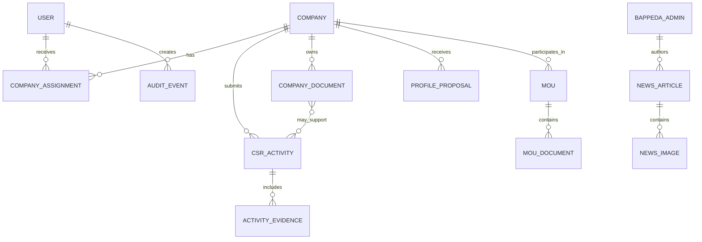

## 12. Frontend-first delivery plan

The frontend is the first product acceptance surface. Phases 0–4 use local,
array-driven fixtures and browser state. No new Supabase schema, storage bucket,
RLS policy, or OpenRouter integration is needed to complete those phases.

```mermaid
flowchart LR
    P0["Phase 0<br/>Product contract"] --> P1["Phase 1<br/>Visual foundation"]
    P1 --> P2["Phase 2<br/>Core CSR loop"]
    P2 --> P3["Phase 3<br/>Content and documents"]
    P3 --> P4["Phase 4<br/>UX acceptance"]
    P4 --> B1["Backend gate<br/>Approve model and boundaries"]
    B1 --> B2["Phase 5<br/>Auth and memberships"]
    B2 --> B3["Phase 6<br/>Activities and publication"]
    B3 --> B4["Phase 7<br/>Documents, profiles, news, MoU"]
    B4 --> B5["Phase 8<br/>Hardening and launch"]
```

### Phase 0 — Product contract

**Deliverable:** This PRD and an agreed screen/state inventory.

- Confirm actors, navigation, status vocabulary, and publication rules.
- Confirm the public/company/Bappeda/superadmin surface split.
- Mark older mockups and plans as historical.

**Exit criteria:** Product owner accepts this PRD as the active product scope.

### Phase 1 — Visual foundation and shells

**Deliverable:** A navigable frontend with realistic fixture data.

- Implement shared visual tokens and typography.
- Implement public, company, Bappeda, and superadmin shells.
- Implement responsive navigation, headers, empty states, and account menus.
- Do not implement backend workflows yet.

**Exit criteria:** All major routes are reachable and visually coherent on
desktop and mobile.

### Phase 2 — Core CSR loop

**Deliverable:** A complete clickable CSR workflow.

- Company dashboard.
- Activity list and detail.
- Four-step activity form.
- Evidence attachment states.
- Draft, submit, revision requested, resubmit, approved, and published states.
- Bappeda review queue and review detail.
- Public activity directory and detail.

**Exit criteria:** The full P0.1 journey can be demonstrated without a backend:

```text
Company creates draft → submits → Bappeda requests revision
→ company resubmits → Bappeda approves → publishes
→ public sees the activity
```

### Phase 3 — Content and supporting workspaces

**Deliverable:** The remaining P0 product journeys in fixtures.

- Standalone company documents.
- Company profile proposals.
- Bappeda follow-up queues.
- News CMS with mocked AI generation.
- News preview and publication.
- MoU register and public MoU detail.
- Superadmin users, assignments, company master, and audit-log screens.

**Exit criteria:** P0.2 through P0.7 can be demonstrated end to end in the
browser.

### Phase 4 — UX acceptance and cleanup

**Deliverable:** A product-owner-approved frontend prototype.

- Remove legacy statuses and fields.
- Remove fixed company-count language.
- Validate public/private display boundaries in every fixture.
- Verify mobile, keyboard, loading, empty, error, and unauthorized states.
- Review copy, labels, information hierarchy, and action clarity.
- Capture remaining decisions that genuinely block backend modeling.

**Exit criteria:** No unresolved product-language or workflow contradiction
remains in the frontend prototype.

### Backend gate

No new backend schema or storage work begins until Phase 4 is accepted.

The backend gate produces a short approved implementation brief containing:

- Accepted content/state model.
- Accepted field list.
- Accepted public/private boundaries.
- Accepted file categories and limits.
- Accepted roles and company assignment rules.
- Accepted audit events.
- Accepted AI integration boundary.

### Phase 5 — Authentication and memberships

**Deliverable:** Real sign-in and scoped workspaces.

- Provisioned users only.
- Company, Bappeda, and superadmin scopes.
- Company assignment.
- Account management.
- Server-enforced authorization.

### Phase 6 — Activities and publication

**Deliverable:** Real CSR submission, private evidence, review, revision,
approval, publication, audit, and public read models.

- Implement the approved activity model.
- Implement private evidence access.
- Implement transactional publication boundaries.
- Verify published-only public responses.

### Phase 7 — Documents, profiles, news, and MoU

**Deliverable:** Real supporting content workflows.

- Standalone document metadata and private storage.
- Profile proposal review.
- News authoring and approved AI assistance.
- Public news interactions with moderation controls.
- MoU register and public visibility.

### Phase 8 — Hardening and launch

**Deliverable:** Release-ready government operational product.

- Authorization denial tests.
- Storage and file validation tests.
- Publication and anti-double-counting tests.
- Audit coverage.
- Backup/restore drill.
- Production configuration and ownership handover.

## 13. Product acceptance checklist

The V1 product is ready for acceptance when:

- The five-state CSR workflow works through the UI.
- Company admins can submit, revise, and resubmit activities.
- Bappeda can review, approve, and publish.
- Public pages show published records only.
- Standalone documents and profile proposals have visible review states.
- Bappeda can create and publish human-reviewed news.
- Superadmin can create users, assign companies, manage master data, and view audit history.
- Account settings work for company and Bappeda users.
- Missing data is not presented as zero.
- Beneficiary count and beneficiary description are absent from the activity workflow.
- No fixed company count appears in product logic or acceptance language.
- Public, company, Bappeda, and superadmin shells are distinct.
- Loading, empty, error, unauthorized, revision, archived, and success states exist.
- Desktop, mobile, keyboard, and basic accessibility review passes.
- The frontend prototype can be demonstrated without Supabase schema changes.

## 14. Risks and decisions intentionally deferred

These decisions should be made only when they block the relevant phase:

- Final production domain and hosting owner.
- Initial admin and superadmin identities.
- Exact file-size and MIME limits for production.
- Whether standalone company documents are publicly downloadable or view-only.
- MoU metadata and document default visibility.
- Comment and like moderation model.
- OpenRouter provider configuration and prompt governance.
- Archive and version-retention periods.
- Backup frequency and recovery targets.
- Launch acceptance owner and date.

Do not resolve these by changing the frontend product flow prematurely. Use
fixtures and explicit decision records until the backend gate.

## 15. Source-of-truth rule

For product questions after this document is accepted:

1. This PRD.
2. Later written product-owner decisions.
3. The accepted frontend prototype and tests.
4. Architecture, security, and operations instructions that do not conflict
   with this PRD.
5. Older handoffs, mockups, plans, and imported workbooks as historical context.

When an older document conflicts with this PRD, keep the older document for
history but implement this PRD.
